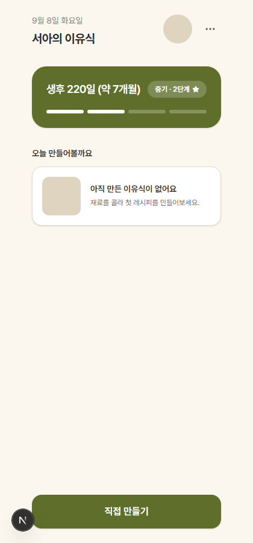
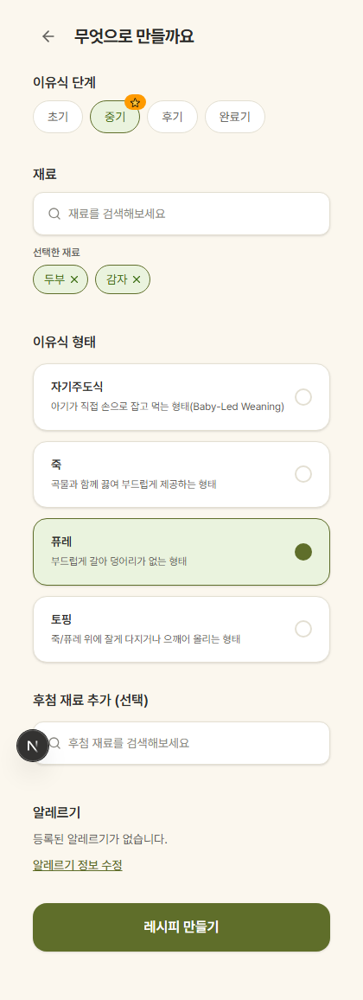
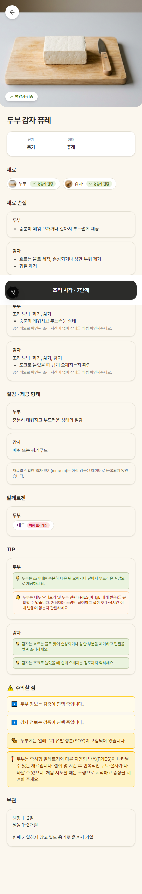
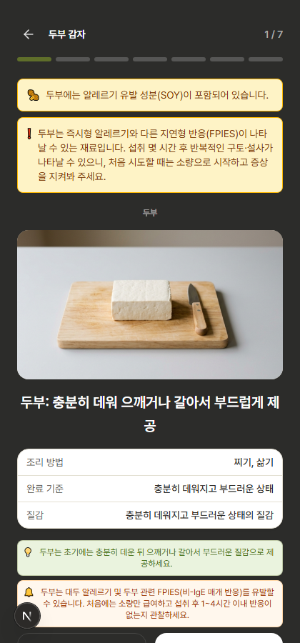

# (A) 영양사 검증 배지 로직 + (B) 비주얼 재작업 — 스크린샷 검수용

이전 커밋(톤 적용 1차)은 아직 커밋 안 된 상태에 이어서 진행. 이번 라운드도 **코드는 미커밋** —
이 리포트(md+스크린샷)만 자동 push.

## 스크린샷 (tofu+potato, 퓨레·중기)

- 
- 
- 
- 

## PART A — has_curated_evidence

### 구현
- `types/api.ts`: `RecipeIngredientView.has_curated_evidence?: boolean` 추가 (optional — shape/particle_size와 동일 컨벤션, 기존 테스트 픽스처 깨지지 않게).
- `lib/recipe/buildRecipeResponse.ts` `toIngredientViews`: `[preparationProfile?.evidence_id, cookingProfile?.evidence_id].some(id => id != null && id !== "E010")`.
- DB/seed 변경 없음 — 이미 select("*")로 가져오던 evidence_id를 읽기만 함.

### 검증 결과 (요청받은 대로 curl + 자동 테스트 둘 다 실행)

curl (`POST /api/v1/recipes/generate`):
```
tofu (stage_2, puree): has_curated_evidence = true
rice (stage_2, porridge): has_curated_evidence = false
```

vitest (`tests/unit/buildRecipeResponse.test.ts`, 새 describe 블록 3건 추가):
```
✓ true — carrot (prep evidence_id: E003)
✓ false — rice (prep+cook 모두 E010)
✓ true — broccoli (prep: E010 / cook: E016 — cooking 쪽만 재료별 근거여도 true)
```
전체 스위트: `npx vitest run` → **10 files, 185 tests, 전부 통과**.

### 배지 배선 변경 (RecipeView.tsx)
- `VerificationBadge`가 이제 `status` 대신 `hasCuratedEvidence`로 "✓ 영양사 검증" 표시 여부를 결정 (기존엔 `verification_status === "VERIFIED"`로 임시 배선했던 것 — 이번에 정식 필드로 교체).
- Recipe 히어로 사진의 "✓ 영양사 검증" 오버레이도 동일하게 `has_curated_evidence` 기준으로 변경.
- 스크린샷 3-recipe.png에서 두부/감자 둘 다 "✓ 영양사 검증"으로 표시됨 — 실제 evidence_id가 둘 다 E010이 아니라서 나온 정상 결과(하드코딩 아님).

### 스코프 밖이라 구현 안 한 것 (제안만)
- `IngredientSearchOverlay.tsx`(Plan 화면 재료 검색 목록)에도 "✓ 영양사 검증" 배지를 넣으려면 `/api/v1/ingredients` 카탈로그 엔드포인트에 `has_curated_evidence`를 새로 노출해야 함 — Part A 지시가 `buildRecipeResponse.ts`로 구현 위치를 명시했고, 카탈로그 목록 API 확장은 별도 데이터 로직 변경이라 이번 스코프(B-4: "데이터 로직/API 구조 변경 금지, Part A 예외 제외")를 벗어남. 대신 이전 세션에서 `verification_status === "VERIFIED"`로 임시로 넣어뒀던(의미가 다른 필드를 잘못 재사용한) 배지는 **제거**함 — 두 화면이 서로 다른 기준의 "영양사 검증"을 보여주는 걸 막기 위함. 필요하면 카탈로그 엔드포인트 확장을 별도 작업으로 진행 가능.

## PART B — 비주얼 재작업

### 폰트
- `@fontsource/pretendard` 추가 (package.json dependencies), `app/layout.tsx`에서 400/500/600/700 weight css import, `globals.css` body font-family를 Pretendard로 교체.
- Noto Serif KR 등 세리프 대비는 적용 안 함 — Pretendard만으로 참고 이미지와 비교했을 때 충분히 가까워 보여서 추가 판단 보류(아래 "여전히 다른 점" 참고).
- Geist Mono는 유지 — Cooking Mode 타이머 숫자(`font-mono`)에만 쓰임, 프롬프트가 언급한 제목 폰트와 무관.
- `app/layout.tsx`의 `lang="en"` → `lang="ko"`로 같이 수정(한국어 앱인데 잘못 설정돼 있던 것 — 폰트 변경과 묶어서 처리).

### 아이콘
- 프로젝트에 아이콘 라이브러리 없었음 → `lucide-react` 추가(제안 후 진행, MIT 라이선스, tree-shakeable).
- 이모지/텍스트 문자로 되어 있던 것들을 아이콘으로 교체: `←`→`ArrowLeft`, `⋯`→`MoreHorizontal`, `🔍`→`Search`, `×`(칩 닫기)→`X`, `✓`→`Check`, `⭐`(추천 배지)→`Star`.

### 카드/여백/버튼
- 카드 모서리: `rounded-lg`/`rounded-xl` → 대부분 `rounded-2xl`(강조 카드는 `rounded-3xl`)로 통일, `shadow-sm` 추가.
- 여백: 섹션 간 `gap-6`→`gap-8`, `mb-6`→`mb-7`, 카드 내부 padding `p-3`→`p-4`, 검색창/버튼 `py-3`→`py-3.5~4`로 확대.
- 하단 강조 버튼(올리브/다크): `rounded-xl`→`rounded-2xl` + `shadow-sm`.

### Cooking Mode 헤더 추가
- 참고 이미지엔 있지만 기존 구현엔 없던 상단 바(뒤로가기 + 레시피명 + "N/M" 카운터)를 추가.
- **새 API 호출 없이** 구현 — `steps` 배열(이미 로드된 데이터)에서 `[...new Set(steps.map(s => s.ingredientName))].join(" ")`로 재료명만 조합(예: "두부 감자"). food_form 명칭("퓨레")까지는 못 붙임 — Cooking Mode는 food-forms를 별도로 fetch하지 않고, 새 fetch 추가는 이번 스코프(B-4) 밖이라 하지 않음.
- 기존 "STEP X / Y" 텍스트는 이 헤더의 카운터와 중복이라 제거하고 카운터 하나로 통합.

### 참고 이미지와 비교했을 때 여전히 다른 점 (솔직 보고)
1. **Home 카드 리듬** — 참고 이미지는 카드 간 간격이 좀 더 크고 카드 자체 높이도 낮아 화면 전체가 더 "숨쉬는" 느낌인데, 실제 구현은 그보다 살짝 조밀함(참고 이미지가 vertical stretch되어 실제 폰 화면 비율보다 세로로 압축돼 보이는 프레젠테이션 이미지라 정확한 비율 비교가 어려움).
2. **Recipe 히어로 사진 하단 라운딩** — 참고 이미지는 사진 카드 자체가 화면 좌우에 약간의 여백을 두고 둥근 사각형으로 떠 있는 느낌인데, 지금 구현은 화면 폭 꽉 채운 배너 형태(풀블리드). 이 차이는 의도적으로 안 건드림 — 각지게 만들려면 사진 좌우에 패딩을 줘야 하는데, 참고 이미지 쪽 여백 폭을 픽셀 단위로 특정하기 어려워 추측성 수치가 될 위험이 있었음.
3. **아이콘 스타일** — lucide는 outline 스타일이 참고 이미지의 아이콘(주로 화살표 하나 정도만 보여서 정확한 비교는 어려움)과 크게 다르진 않아 보이나, 참고 이미지 해상도가 낮아 완전히 동일한 라이브러리인지는 확인 불가.

## 변경 파일 (git diff --stat)

```
app/cooking/page.tsx                         |   2 +-
app/globals.css                              |  26 +--
app/layout.tsx                               |  19 +--
app/plan/page.tsx                            |   1 -
app/recipe/page.tsx                          |   2 +-
components/cooking/CookingModeView.tsx       |  71 +++++---
components/input/IngredientSearchOverlay.tsx |  51 +++---
components/input/RecipeInputForm.tsx         | 100 ++++++-----
components/plan/PlanView.tsx                 |  20 ++-
components/profile/BabyHome.tsx              | 116 ++++++++-----
components/recipe/RecipeView.tsx             | 241 ++++++++++++++++++---------
components/shared/IngredientThumbnail.tsx    |   2 +-
components/shared/IngredientTipList.tsx      |   2 +-
components/shared/SafetyNoteItem.tsx         |   2 +-
lib/recipe/buildRecipeResponse.ts            |   4 +
package-lock.json                            |  23 +++
package.json                                 |   2 +
tests/unit/buildRecipeResponse.test.ts       |  25 +++
types/api.ts                                 |   9 +
19 files changed, 476 insertions(+), 242 deletions(-)
```

`npm run build` 통과, `npx tsc --noEmit` 0 error, `npx vitest run` 185/185 통과.

## 알려진 스크린샷 아티팩트 (버그 아님, 지난 라운드와 동일한 원인)

- 3-recipe.png 중간의 검은 바("N 조리 시작 · 7단계")는 `position: fixed` 버튼이 Playwright `fullPage` 캡처에서 스크롤 위치마다 겹쳐 그려지는 촬영 아티팩트. 실제 브라우저에서는 하단 고정.
- "N" 원형 아이콘은 브라우저 확장 프로그램 오버레이.

## commit/push 상태

- 이 리포트 파일 + 스크린샷 4장만 commit/push (CLAUDE.md §1, 승인 불필요 대상).
- 리디자인 소스 19개 파일(A+B 전체)은 **미커밋** — 검수 후 승인 시 커밋 진행.
