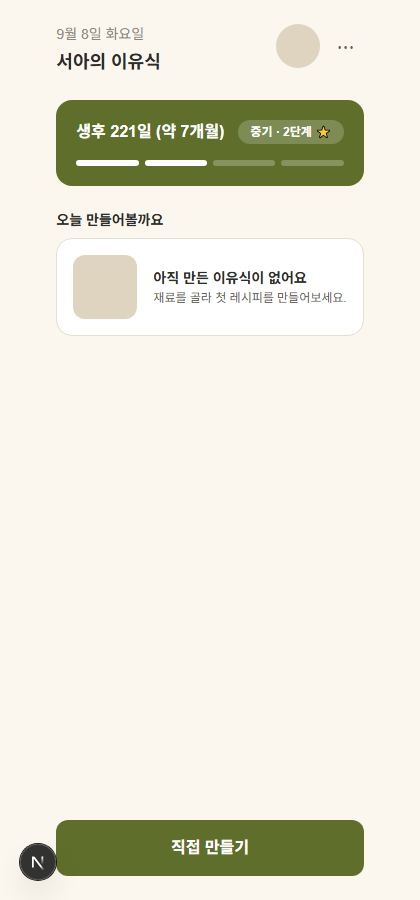
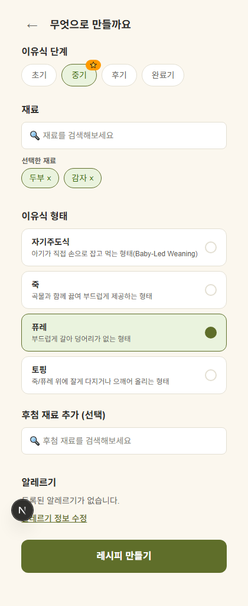
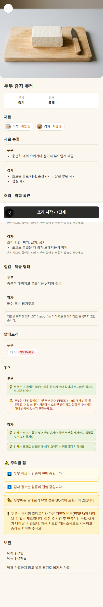
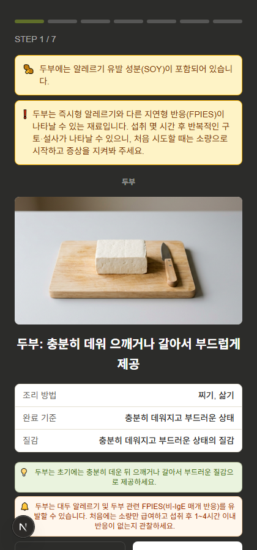

# 전체 비주얼 리디자인 — 스크린샷 검수용

작업 프롬프트: 크림/올리브 톤앤매너 적용 (Home/Plan/Recipe/Cooking Mode 4화면).

## 스크린샷 (tofu 레시피, 퓨레·중기, 서아/생후 221일)

- 
- 
- 
- 

캡처 방법: Playwright(headless chromium, viewport 420x900), 로컬 dev server(localhost:3000) 대상. 스크립트는 스크래치 디렉터리에만 존재(레포에 커밋 안 함, devDependency 추가 없음).

## 변경 파일 (git diff --stat)

```
app/cooking/page.tsx                         |   2 +-
app/globals.css                              |  23 ++--
app/plan/page.tsx                            |   1 -
app/recipe/page.tsx                          |   2 +-
components/cooking/CookingModeView.tsx       |  58 ++++----
components/input/IngredientSearchOverlay.tsx |  30 +++--
components/input/RecipeInputForm.tsx         |  81 +++++++-----
components/plan/PlanView.tsx                 |  17 ++-
components/profile/BabyHome.tsx              | 115 ++++++++++------
components/recipe/RecipeView.tsx             | 190 +++++++++++++++++++--------
components/shared/IngredientThumbnail.tsx    |   2 +-
components/shared/IngredientTipList.tsx      |   2 +-
components/shared/SafetyNoteItem.tsx         |   2 +-
13 files changed, 337 insertions(+), 188 deletions(-)
```

`git diff`는 className/style 변경만 포함 — 함수 시그니처, API 호출, props, 데이터 fetch 로직 무변경. `npm run build` 통과 (TypeScript 0 error).

프롬프트 대상 목록(§2)에 없던 파일 중 함께 수정한 것: `app/*/page.tsx`(중복 헤더 제거·색상 토큰), `components/input/IngredientSearchOverlay.tsx`(Plan 화면의 실제 검색 UI라 §6 Plan 스펙에 포함), `components/shared/IngredientTipList.tsx` / `SafetyNoteItem.tsx`(Recipe·Cooking 두 화면이 공유하는 하위 컴포넌트라 톤 적용 안 하면 파란색이 남음).

## 프롬프트와 실제 코드가 어긋난 지점 (구현 전 사용자 승인 받음)

1. **Home 단계 카드 하단 설명 문장** ("이 단계는 곱게 으깬 퓨레와... 알맞습니다") — `Stage` 타입에 해당 필드 없음(`types/domain.ts` L54-60: id/name_ko/sort_order/readiness_required/is_active 뿐). → **문장 생략**으로 결정(사용자 승인).
2. **Home "오늘 만들어볼까요" 추천 레시피 카드** — 저장되는 건 `recentIngredientIds`(재료 ID 배열)뿐, 레시피명/형태/시간 등 미저장. → **정적 안내 카드**("아직 만든 이유식이 없어요")로 대체(사용자 승인). 새 저장 로직 추가 안 함(§3 스코프 준수).
3. **RecipeView 상단 히어로 사진** — 프롬프트는 "이미 이미지 연결 완료, 톤만 적용"이라 전제했지만 실제 `RecipeView.tsx`에는 히어로 이미지가 없었음(h1이 바로 시작). CookingModeView는 프롬프트 설명대로 이미 구현되어 있었음(확인됨, 이쪽은 톤만 변경). → 기존 `IngredientThumbnail`/`CookingPhoto`와 동일한 정적 경로 컨벤션(`/images/ingredients/{id}/{id}_{raw|texture}.png`)으로 `RecipeHeroPhoto`를 새로 추가(첫 번째 base 재료 사용, 후보 이미지 전부 실패 시 accent-photo-bg 색상 패널로 조용히 대체). 새 API 호출 없음 — 기존에 노출되던 재료 이미지를 크게 보여주는 것뿐.
4. **Recipe 상단 3칸 요약** — 프롬프트는 "조리 시간/형태/입자 크기"였으나 이 셋은 레시피 전체 단위 필드가 아니라 재료별 필드(`RecipeIngredientView.cooking.recommended_time`, `.shape`, `.particle_size`)라 레시피 레벨로 합산하면 근거 없는 수치가 됨. → 레시피 레벨에 실제로 존재하는 필드만 사용(**단계/형태/인분**), 조리시간·질감 정보는 기존 위치(재료별 "조리·익힘 확인", "질감·제공 형태" 섹션)에 유지.
5. **"영양사 검증" 배지** — `verification_status` 필드는 이미 존재(`VERIFIED`/`NEEDS_REVIEW`/`INFERRED`/`UNSUPPORTED`). `VERIFIED`일 때만 올리브 배지로 표시하도록 `RecipeView`/`IngredientSearchOverlay`에 조건 추가 — 이번 QA 시드 데이터(두부·감자)는 둘 다 `NEEDS_REVIEW`라 스크린샷엔 "확인 중" 배지만 보임(정상 동작, 버그 아님).
6. **하단 "조리 시작" 버튼 라벨** — 프롬프트 예시("조리 시작 · 5단계")처럼 단계 수를 실제로 계산해 표시(`buildCookingSteps(recipe).length` 재사용, CookingModeView와 동일 함수 — 새 로직 아님).

## 알려진 스크린샷 아티팩트 (버그 아님)

- 3-recipe.png 중간에 검은 바("N 조리 시작 · 7단계")가 본문 위에 겹쳐 보이는 것은 `position: fixed` 하단 버튼을 Playwright `fullPage` 캡처가 스크롤 위치마다 반복 렌더링해서 생기는 촬영 아티팩트. 실제 브라우저에서는 화면 하단에 고정된 채로 정상 동작.
- "N" 원형 아이콘은 브라우저 확장 프로그램 오버레이(우리 UI 아님).

## Known gap

- Home 화면은 실 데이터(추천 레시피 저장)가 없어 "오늘 만들어볼까요" 섹션이 항상 정적 안내만 보여줌 — 추천 로직 자체는 이번 스코프 밖(§4 금지사항: 자동 추천 로직 추가 금지).
