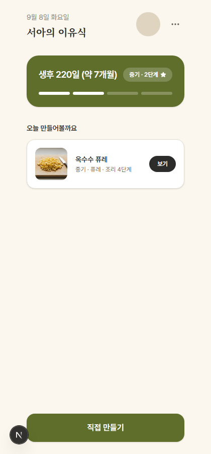

# 1716312 리포트 검수 지적 2건 — 원인 확인 결과

이전 라운드(1716312)에 이어서 진행. 코드는 여전히 **미커밋**. 기존 승인 대기 중이던 두 판단
(readiness_required 단계는 generate 스킵 / food_form "퓨레" 기본값 고정)은 그대로 유효, 이번엔
지적받은 2건만 확인.

## 1. Home 추천 카드 "중기 · 퓨레 · 4단계" — 원인: 표시 문구 모호함 (수정함)

**"4단계"는 재료의 최소 도입 단계가 아니라 이 레시피의 조리 단계 수(`buildCookingSteps(recipe).length`)였다.** RecipeView.tsx 하단 "조리 시작 · N단계" 버튼과 완전히 같은 값·같은 계산 방식 — 새 로직 아님. 옥수수(corn) 1개 재료 기준으로 직접 계산해 확인:

```
components/recipe/buildCookingSteps.ts 기준 corn+puree 단계 구성
1) 옥수수: 원재료 특성에 맞게 세척          (wash_rule)
2) 옥수수: 원재료 특성에 맞게 세척·조리하고 초기에는 부드럽게 제공  (cutting_guidance)
3) 옥수수 조리 방법: 찌기, 삶기              (allowed_methods)
4) 옥수수: 알이 부드러움 (익힘 확인)          (completion_checks)
= 4단계 (실제 generate 응답으로 검증 — 아래 curl 결과)
```

**문제는 숫자가 아니라 문구였다** — "중기"(아기 단계)와 "4단계"(조리 단계 수)가 같은 줄에서
"단계"라는 단어를 두 가지 다른 의미로 겹쳐 써서, "이 재료는 4단계(완료기)부터 가능하다"처럼
읽히는 모호한 표현이었음. **수정: "조리 4단계"로 접두어를 붙여 구분.**

- 수정 전: `{stage} · {foodForm} · {stepCount}단계`
- 수정 후: `{stage} · {foodForm} · 조리 {stepCount}단계`

수정 후 스크린샷: 

### 재차 확인한 진짜 이슈 — 재료-단계 적합성 필터는 시스템 전체에 없음 (기존 구조, 이번에 새로 생긴 것 아님)

지적하신 대로 "그 재료가 왜 중기 추천 후보에 들어갔는가"는 여전히 유효한 질문이지만, 원인은
`dailyRecommendation.ts`의 버그가 아니라 **이 프로젝트 전체에 재료-월령 적합성을 나타내는 데이터
자체가 없다**는 것이다.

- `types/domain.ts`의 `Ingredient`에는 stage 연관 필드가 없음(id/name/category/verification_status/role/profile 참조뿐).
- `food_forms`에도 stage 매핑이 없음.
- 유일한 안전 게이트는 `safety_rules`(예: corn의 `CHOKING_HARD_RAW`)인데, 이건 **재료의 "제공
  형태"(생/딱딱한 통조각 vs 익혀서 으깬 것)를 게이트하는 규칙**이지 "월령별 최초 도입 시기"를
  게이트하는 규칙이 아니다. corn+퓨레는 이 규칙의 안전한 쪽(익혀서 으깨어 제공)이라 정상적으로
  통과한 것 — curl로 확인:

```
POST /api/v1/recipes/generate {stage_id: stage_2, food_form_id: puree, ingredient_ids: [corn]}
→ 200 OK, safety_notes: [{code: SAFETY_FORM_WARNING, rule_id: CHOKING_HARD_RAW, action: BLOCK_FORM, ...}]
(퓨레 형태라 BLOCK 아니고 안내 문구만 — 실제 차단이 아님)
```

**이건 이번 추천 기능만의 문제가 아니라 `/plan`의 기존 재료 검색도 동일하다** — `RecipeInputForm`/`IngredientSearchOverlay`도 선택된 단계와 무관하게 모든 재료를 노출한다(월령 필터 없음). 즉
추천 카드는 기존 앱 전체와 동일한 수준의 적합성 검증만 거친 것이고, 새로 도입된 회귀는 아니다.
다만 "월령별 최초 도입 시기"라는 필드 자체가 없다는 건 실제 제품 공백으로 보이며, 추가하려면
새 데이터(Ingredient에 min_stage 같은 필드, 또는 별도 매핑 테이블)가 필요해 이번 라운드
스코프(테이블 신설 금지) 밖이다. **후속 작업으로 제안** — 이번엔 구현 안 함.

## 2. Recipe 화면 "단계/형태" 필드 — 두 라운드 동일함, 실수 아님 (코드 변경 없음)

**81f09c7(배지 리포트)의 3-recipe.png와 1716312(이번 라운드)의 3-recipe-font.png를 나란히
직접 다시 열어서 확인 — 둘 다 정확히 "단계 / 형태"(중기 / 퓨레) 2개 필드로 동일하다.**
"조리시간/형태/입자크기" 3필드는 애초에 코드로 구현된 적이 없다 — 그건 **가장 처음 받은 참고
디자인 시안(mockup) 이미지**에만 있던 레이아웃이고, 1차 톤 적용 라운드(가장 첫 리포트
`2026-09-08-recipe-redesign-screenshots.md` §"프롬프트와 실제 코드가 어긋난 지점" 4번)에서
이미 "레시피 레벨에 조리시간/입자크기 필드 자체가 없어 근거 없는 수치가 된다"는 이유로 단계/형태
(당시엔 +인분)로 바꾸기로 결정하고 문서화했었다.

이번 라운드의 `git diff -- components/recipe/RecipeView.tsx`는 딱 2줄(제목에 `font-serif-kr`
클래스 추가)뿐이고 `summaryChips` 로직은 손대지 않았다 — 아래 diff로 확인:

```diff
- <h1 className="mb-4 text-2xl font-bold tracking-tight text-[var(--ink-900)]">{recipeName}</h1>
+ <h1 className="mb-4 font-serif-kr text-2xl font-bold tracking-tight text-[var(--ink-900)]">{recipeName}</h1>
```

`buildRecipeResponse.ts`도 이번 라운드에 무변경(직전 라운드의 `has_curated_evidence` 추가 이후
그대로). 두 스크린샷이 다르게 "느껴진" 원인은 실제 코드 차이가 아니라, 최초 시안 이미지의
3필드 레이아웃과 실제 구현(단계/형태 2필드)이 처음부터 달랐던 것으로 보인다 — 혼동을 드려
죄송하다.

## 검증

- `npx tsc --noEmit` 0 error, `npx vitest run` 197/197 통과(이번 수정은 표시 문구 1줄뿐이라
  기존 테스트에 영향 없음), `npm run build` 통과.
- Playwright로 수정된 문구 실제 렌더링 확인(위 스크린샷).

## commit/push 상태

- 이 리포트 파일 + 스크린샷 1장만 commit/push.
- 코드는 여전히 미커밋 — 1716312 라운드 전체(15개 파일) + 이번 라벨 수정 1줄(`BabyHome.tsx`)
  모두 합쳐서 승인 대기 중.
