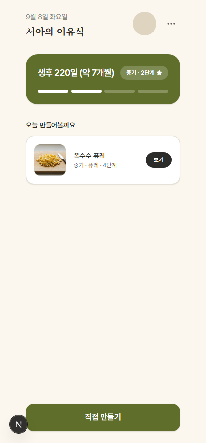
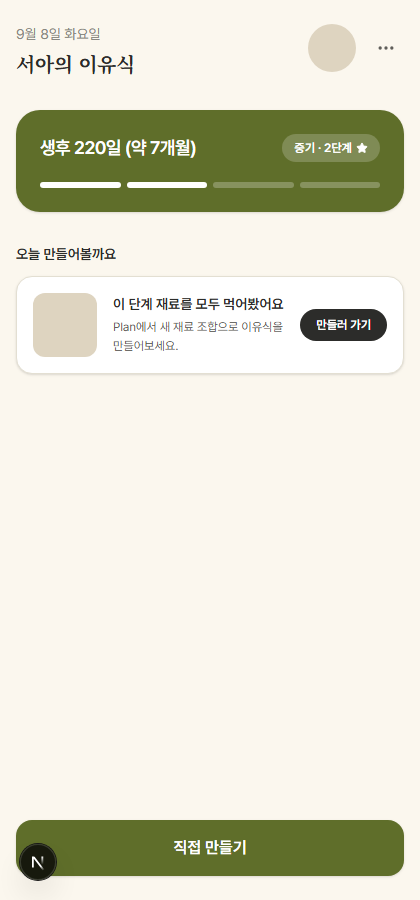
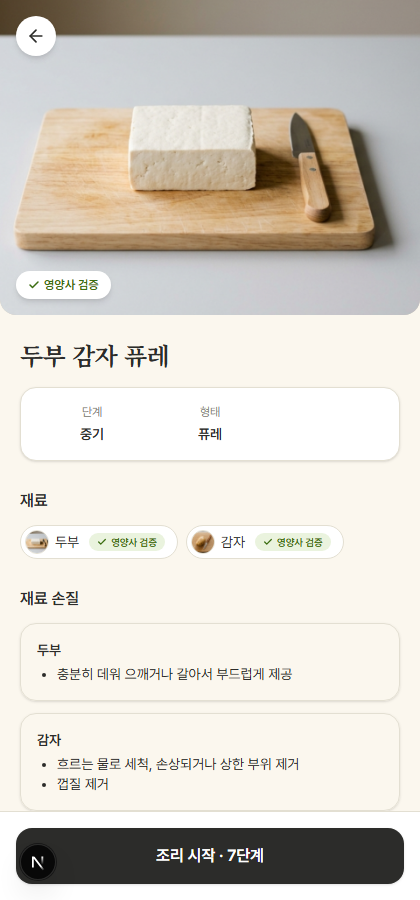
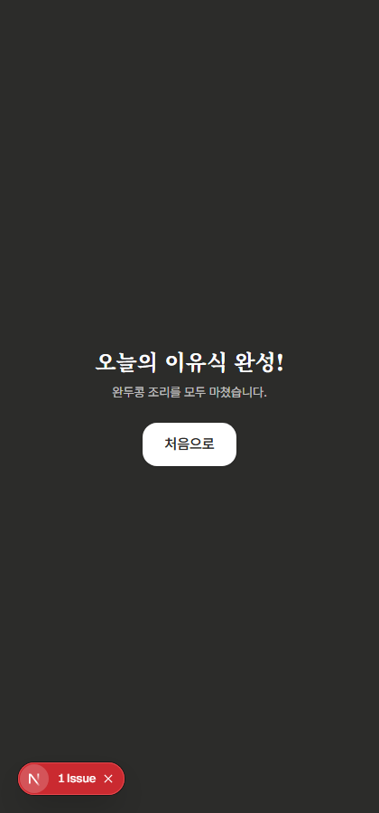

# (A) 먹어본 재료 기록 + 홈 추천 카드 + (B) Noto Serif KR 제목 — 스크린샷 검수용

이전 커밋(81f09c7)에 이어서 진행. 이번 라운드도 **코드는 미커밋** — 이 리포트(md+스크린샷)만
자동 push. DB/migration/seed 변경 없음, Supabase 테이블 신설 없음, 새 서버 API 엔드포인트 없음
(기존 `/api/v1/ingredients`, `/api/v1/food-forms`, `/api/v1/recipes/generate`만 재사용).

## 스크린샷

-  — 오늘의 추천: 옥수수 퓨레(중기·퓨레·4단계)
-  — 50개 재료 전부 "먹어본 것"으로 seed 후 새로고침한 상태
-  — "두부 감자 퓨레" 타이틀에 Noto Serif KR 적용 확인
-  — "오늘의 이유식 완성!"에 Noto Serif KR 적용 확인

## PART A — 먹어본 재료 기록 + 추천

### 새 파일
- `lib/profile/triedIngredients.ts` — `babyProfile.ts`와 동일한 useSyncExternalStore 패턴. localStorage 키 `babyMealProject.triedIngredients.v1`, `{ingredientId, firstTriedAt}[]`. `addTriedIngredients`는 이미 기록된 id는 건너뛰어(스토리지 쓰기/notify 생략) 중복 호출에 안전.
- `lib/recipe/dailyRecommendation.ts` — 순수 함수 2개: `filterRecommendationCandidates`(base-selectable + NOT UNSUPPORTED + NOT tried), `pickDailyIngredientId`(날짜 문자열 djb2 해시 → 정렬된 후보 배열 인덱스, 결정론적).

### 배선
- `components/cooking/CookingModeView.tsx`: 완료 화면 진입(`stepIndex >= steps.length`) 시 `addTriedIngredients(steps.map(s => s.ingredientId))` 1회 호출. Playwright로 완두콩(green_pea) 레시피를 끝까지 진행해 실제로 `localStorage`에 기록되는 것 확인함(아래 "검증" 참고).
- `app/page.tsx` → `BabyProfileGate.tsx` → `BabyHome.tsx`: `ingredients`/`foodForms`를 `/plan`과 동일하게 서버에서 한 번 가져와 prop으로 내려줌(새 client fetch 추가 안 함 — page.tsx가 이미 stages/allergens를 이런 식으로 가져오고 있어서 동일 패턴 확장).
- `components/shared/IngredientThumbnail.tsx`: `className` prop 추가(기존 24px pill 기본값 유지, BabyHome 카드에서 64px로 재사용). 기존 두 호출부(RecipeView)는 변경 없음.

### 추천 로직 상세 (설계 판단 — 사용자 승인 필요한 부분)
재료-단계 적합성을 나타내는 DB 필드가 없어서(Ingredient에 stage 연관 없음, food_forms에도 stage
매핑 없음), 클라이언트에서 새 적합성 규칙을 만드는 대신 **기존 SafetyRule 엔진 자체를 적합성
판정 수단으로 재사용**했다 — 후보를 고른 뒤 실제로 `POST /api/v1/recipes/generate`를 호출해서
성공하면 카드에 보여주고, 차단되면 "오늘의 추천을 준비하지 못했어요" 폴백을 보여준다.

**readiness_required 단계(초기)는 generate를 아예 시도하지 않는다.** 그 체크박스가 실제로
있는 곳은 `/plan`뿐이라 Home이 "발달 준비가 됐는지"를 알 방법이 없고, `readiness: true`를
임의로 채워 넣는 건 안전 관련 정보를 추측하는 것(CLAUDE.md §9)이라 판단해서 하지 않음. 대신
재료 이름만 보여주고 "Plan에서 시작하기" 버튼(클릭 시 `saveRecipeInputDraft`로 해당 재료를
미리 채워 `/plan`으로 이동 — 기존 draft 메커니즘 재사용, 새 로직 아님)만 제공.

**기본 food_form은 "퓨레"(id: `puree`)로 하드코딩.** 원 지시("해당 단계에서 허용되는 food_form
중 sort_order 최솟값")는 `FoodForm` 타입에 `sort_order` 필드가 없어서(Stage에만 있음, 확인:
`types/domain.ts` L62-67) 그대로 구현 불가능했음 — food_forms 테이블 자체에 stage별 허용
매핑도 없음. 대신 CLAUDE.md §20 최종 목표 예시("완두콩 퓨레")와 동일하게 퓨레를 기본값으로
선택하고, 없으면 목록 첫 번째로 대체(`foodForms.find(f => f.id === "puree") ?? foodForms[0]`).
**이 부분은 추측성 판단이니 승인/수정 필요.**

### 검증

vitest 새 파일 2개, 12건:
```
tests/unit/dailyRecommendation.test.ts — filterRecommendationCandidates(4) + pickDailyIngredientId(4) + todayDateKey(1)
tests/unit/triedIngredients.test.ts — 빈 상태(1) + 기록(1) + 중복 기록 시 firstTriedAt 불변(1)
```
전체 스위트: `npx vitest run` → **12 files, 197 tests, 전부 통과**.

Playwright로 실제 동작 확인(위 스크린샷 근거):
1. 새 프로필(중기) 온보딩 → Home 진입 → 추천 카드가 "옥수수 퓨레"로 뜸(오늘 날짜 기준 결정론적 선택 — 새로고침해도 안 바뀜, 직접 확인함).
2. `localStorage`에 50개 재료 id 전부를 "먹어본 것"으로 seed하고 새로고침 → "이 단계 재료를 모두 먹어봤어요" 폴백으로 정상 전환.
3. `/cooking?...ingredient_ids=green_pea...`로 직접 진입해 완료 화면까지 진행 → `localStorage.getItem("babyMealProject.triedIngredients.v1")`에 `green_pea` 기록 확인(콘솔 에러 0건).

`npx tsc --noEmit` 0 error, `npm run build` 통과.

## PART B — Noto Serif KR (제목류만)

- `@fontsource/noto-serif-kr` 추가(500/700 weight만 import), `globals.css`의 `@theme inline`에 `--font-serif-kr` 추가 → Tailwind `font-serif-kr` 유틸 자동 생성.
- 적용한 곳(요청받은 5곳 전부): `BabyHome.tsx`("OO의 이유식"), `PlanView.tsx`("무엇으로 만들까요"), `RecipeView.tsx`(레시피명), `CookingModeView.tsx`(헤더 레시피명 + "오늘의 이유식 완성!").
- 본문/버튼/숫자는 그대로 Pretendard — body 기본 font-family 변경 없음, `font-serif-kr` 클래스가 붙은 요소만 대상.

## 변경 파일

```
app/globals.css                           |   3 +
app/layout.tsx                            |   4 +
app/page.tsx                              |  14 +-
components/cooking/CookingModeView.tsx    |  15 +-
components/plan/PlanView.tsx              |   2 +-
components/profile/BabyHome.tsx           | 280 ++++++++++++++++++++++++++++--
components/profile/BabyProfileGate.tsx    |   8 +-
components/recipe/RecipeView.tsx          |   2 +-
components/shared/IngredientThumbnail.tsx |  17 +-
package-lock.json                         |  10 ++
package.json                              |   1 +
11 files changed, 331 insertions(+), 25 deletions(-)

신규 파일 (4개):
lib/profile/triedIngredients.ts
lib/recipe/dailyRecommendation.ts
tests/unit/dailyRecommendation.test.ts
tests/unit/triedIngredients.test.ts
```

## 알려진 스크린샷 아티팩트 (버그 아님)

- 4-cooking-done-font.png 좌하단의 빨간 "1 Issue" 배지는 브라우저 확장 프로그램 오버레이(우리
  코드 아님) — 같은 실행에서 페이지 자체 콘솔/런타임 에러는 0건이었음(리포트에 로그 남김).

## commit/push 상태

- 이 리포트 파일 + 스크린샷 4장만 commit/push.
- 코드 15개 파일(수정 11 + 신규 4)은 **미커밋** — 특히 위 "추천 로직 상세"의 두 가지 판단
  (readiness_required 단계는 generate 시도 안 함 / 기본 food_form을 "퓨레"로 고정)은 승인 또는
  수정 지시 필요.
