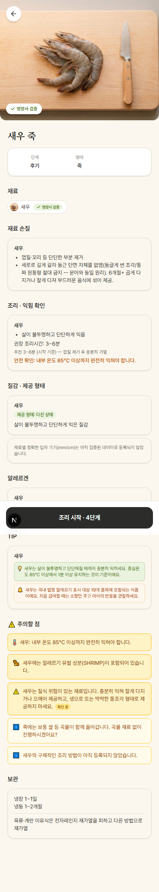
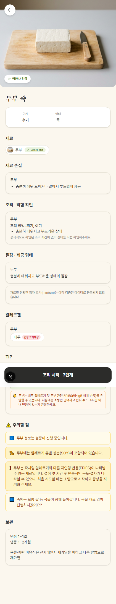

# migration 0060(새우 evidence) + 0061(Tier2 11종 dietitian_verified) — 실행 완료 보고

Scope: 요청서(2026-09-09) → 원격 DB 실행 완료. `0060_shrimp_evidence.sql` →
`0061_dietitian_verified_tier2.sql` 순서로 순수 DML(DDL 없음, `dietitian_verified_at`
컬럼은 migration 0057에서 이미 생성됨) — service-role key로 Claude Code가 PostgREST
직접 실행(0058/0059와 동일 절차).

**상태**: 원격 DB 적용 완료 + seed.sql append 완료. **migration 파일 2개와
seed.sql은 아직 커밋하지 않음(Desktop 확인 대기)** — 이 보고서와 스크린샷만 즉시
commit+push.

## 0. 요청서 SQL 그대로 실행 — 컬럼명/스키마 불일치 없음

0058 때와 달리 이번 요청서는 `evidence` 테이블 실제 컬럼명(`url`/`checked_at`/
`applicability`)을 이미 정확히 사용하고 있어 수정 없이 그대로 실행됨. 실행 전
`evidence`/`safety_rules`/`ingredients` 테이블에서 대상 id(`E087`,
`SHRIMP_CYLINDRICAL_CHOKING`) 미존재, `prep_shrimp`/`cook_shrimp`/11종
`dietitian_verified_at` 전부 사전 상태(`E010`/`E010`, `null`×11) 확인 후 진행.

## 1. Pre/Post snapshot (원격 DB, service-role client, PostgREST `Prefer: count=exact`)

| table | pre | post | delta |
|---|---|---|---|
| evidence | 86 | 87 | +1 |
| preparation_profiles | 70 | 70 | 0 (UPDATE만) |
| cooking_profiles | 70 | 70 | 0 (UPDATE만) |
| safety_rules | 43 | 44 | +1 |
| ingredient_safety_rules | 85 | 86 | +1 |
| ingredients | 70 | 70 | 0 (UPDATE만, dietitian_verified_at 11건) |

## 2. migration 0060 — 새우 evidence 반영 결과 (post-snapshot 재조회)

```json
// evidence E087
{
  "id": "E087",
  "organization": "Solid Starts",
  "title": "Shrimp for Babies",
  "url": "https://solidstarts.com/foods/shrimp/",
  "source_tier": "TIER_1",
  "checked_at": "2026-09-09",
  "status": "VERIFIED"
}

// preparation_profiles prep_shrimp (변경 후)
{
  "id": "prep_shrimp",
  "cutting_guidance": "세로로 길게 갈라 둥근 단면 자체를 없앰(둥글게 썬 조각/통짜 원통형 절대 금지 -- 문어와 동일 원리). 6개월+ 곱게 다지거나 잘게 다져 부드러운 음식에 섞어 제공.",
  "evidence_id": "E087"
}

// cooking_profiles cook_shrimp (변경 후)
{ "id": "cook_shrimp", "evidence_id": "E087" }  // 그 외 필드 변경 없음

// safety_rules SHRIMP_CYLINDRICAL_CHOKING
{
  "id": "SHRIMP_CYLINDRICAL_CHOKING",
  "rule_type": "choking",
  "severity": "HIGH",
  "action": "BLOCK_FORM",
  "evidence_id": "E087",
  "status": "NEEDS_REVIEW"
}

// ingredient_safety_rules
{ "ingredient_id": "shrimp", "safety_rule_id": "SHRIMP_CYLINDRICAL_CHOKING", "evidence_id": null }
```

새우는 UPDATE 대상이라 `prep_shrimp`/`cook_shrimp`/`shrimp` 행 자체는 신규 생성 아님
(evidence_id/cutting_guidance만 교체) — abalone(신규 prep row 생성)과 달리
`ingredients.preparation_profile_id`는 이미 `prep_shrimp`로 연결돼 있어 변경 없음.

## 3. migration 0061 — Tier2 11종 dietitian_verified_at 반영 결과

`update ingredients set dietitian_verified_at = '2026-09-09' where id in (...)` 실행 후
11건 전부 재조회로 확인:

| id | dietitian_verified_at (pre → post) |
|---|---|
| egg | null → 2026-09-09 |
| milk | null → 2026-09-09 |
| tofu | null → 2026-09-09 |
| wheat | null → 2026-09-09 |
| peanut | null → 2026-09-09 |
| shrimp | null → 2026-09-09 |
| squid | null → 2026-09-09 |
| mussel | null → 2026-09-09 |
| abalone | null → 2026-09-09 |
| cheese | null → 2026-09-09 |
| yogurt | null → 2026-09-09 |

## 4. 테스트

| 항목 | 결과 |
|---|---|
| `npx tsc --noEmit` | 에러 0건 |
| `npx vitest run` | **200/200 PASS** (회귀 없음, 신규 테스트 없음 — 코드 변경 없는 순수 DML) |
| `npm run build` | 성공 |
| `npm run test:integration`(실 HTTP, live remote DB) | **46/46 PASS** (case 27: cheese `dietitian_verified: true` 확인 포함) |

## 5. curl 실측

### 5-1. `POST /api/v1/recipes/generate` (stage_3, porridge, shrimp)

```json
{
  "id": "shrimp",
  "preparation": {
    "peel_rule": "껍질·꼬리 등 단단한 부분 제거",
    "cutting_guidance": "세로로 길게 갈라 둥근 단면 자체를 없앰(둥글게 썬 조각/통짜 원통형 절대 금지 -- 문어와 동일 원리). 6개월+ 곱게 다지거나 잘게 다져 부드러운 음식에 섞어 제공."
  },
  "has_curated_evidence": true,
  "dietitian_verified": true
}
```

`safety_notes`에 신규 항목 확인:

```json
{
  "code": "SAFETY_FORM_WARNING",
  "message": "새우는 질식 위험이 있는 재료입니다. 충분히 익혀 잘게 다지거나 으깨어 제공하고, 생으로 또는 딱딱한 통조각 형태로 제공하지 마세요.",
  "rule_id": "SHRIMP_CYLINDRICAL_CHOKING",
  "rule_status": "NEEDS_REVIEW",
  "severity": "HIGH",
  "action": "BLOCK_FORM",
  "ingredient_id": "shrimp"
}
```

기존 `FISH_SHELLFISH_TEMP_MFDS`(85°C 조리)/`SHRIMP_ALLERGEN` 규칙과 공존, 서로 모순
없음. **VALIDATION_FAILED 없이 정상 생성 확인**(migration 전에는 `has_curated_evidence:
false`였으나 정확한 before/after 비교는 하지 않음 — E010/E010 상태였으므로 로직상
false였을 것으로 추정만 가능, 실측은 post 상태만 확보).

### 5-2. `POST /api/v1/recipes/generate` (stage_3, porridge, tofu)

```json
{ "has_curated_evidence": true, "dietitian_verified": true }
```

## 6. 스크린샷

Playwright(headless chromium, viewport 420×1400, `waitUntil: networkidle`)로
로컬 dev server(localhost:3000, 기존 실행 중이던 인스턴스 재사용) 대상 캡처. 스크립트는
스크래치 디렉터리에만 존재(레포에 커밋 안 함, devDependency 추가 없음).

- 
  — `/recipe?stage_id=stage_3&food_form_id=porridge&ingredient_ids=shrimp&readiness=true`.
  재료 뱃지·재료 손질(신규 cutting_guidance)·주의할 점(신규 `SHRIMP_CYLINDRICAL_CHOKING`
  경고, "확인 중" 상태 배지 포함) 전부 노출.
- 
  — `/recipe?stage_id=stage_3&food_form_id=porridge&ingredient_ids=tofu&readiness=true`.
  헤더 이미지 하단 + 재료 뱃지에 "✓ 영양사 검증" 노출.

## 7. 파일 변경 (커밋 대기 중 — Desktop 확인 후 사용자 승인 시 커밋)

| 파일 | 변경 | 커밋 상태 |
|---|---|---|
| `supabase/migrations/0060_shrimp_evidence.sql` | 신규 | uncommitted |
| `supabase/migrations/0061_dietitian_verified_tier2.sql` | 신규 | uncommitted |
| `supabase/seed.sql` | append (migration 0060/0061 mirror) | uncommitted |
| 이 보고서 + 스크린샷 2장 | 신규 | 즉시 commit+push (아래) |
| 코드(`lib/`/`app/`/`components/`) | 변경 없음 | — |
