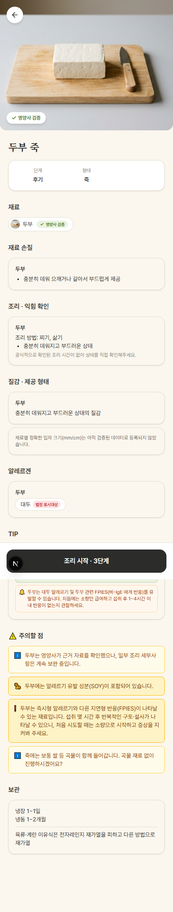
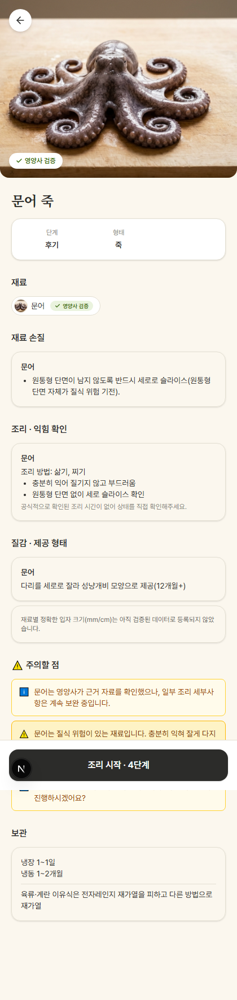

# migration 0062(Tier3 13종 dietitian_verified) + 배지 모순 문구 수정 — 실행 완료 보고

Scope: 요청서(2026-09-09) → (1) 원격 DB 실행 완료, (2) 코드 수정 완료(테스트 통과, 미커밋).

**상태**: 원격 DB(migration 0062) 적용 완료 + seed.sql append 완료. **migration 파일과
seed.sql은 아직 커밋하지 않음(Desktop 확인 대기)**. 코드 변경(`validateRecipeInput.ts` +
테스트)도 실제 로직 변경이라 **미커밋** — 이 보고서와 스크린샷만 즉시 commit+push.

## 1. migration 0062 — 원격 DB 실행

순수 DML(`update ingredients set dietitian_verified_at = ...`), service-role key로 Claude
Code가 PostgREST 직접 실행(0058~0061과 동일 절차).

### Pre/Post snapshot (13건 전수 재조회)

| id | verification_status | dietitian_verified_at (pre → post) |
|---|---|---|
| bell_pepper | NEEDS_REVIEW | null → 2026-09-09 |
| burdock | NEEDS_REVIEW | null → 2026-09-09 |
| chickpea | NEEDS_REVIEW | null → 2026-09-09 |
| flounder | NEEDS_REVIEW | null → 2026-09-09 |
| halibut | NEEDS_REVIEW | null → 2026-09-09 |
| kohlrabi | NEEDS_REVIEW | null → 2026-09-09 |
| lentil | NEEDS_REVIEW | null → 2026-09-09 |
| lotus_root | NEEDS_REVIEW | null → 2026-09-09 |
| octopus | NEEDS_REVIEW | null → 2026-09-09 |
| persimmon | NEEDS_REVIEW | null → 2026-09-09 |
| plum | NEEDS_REVIEW | null → 2026-09-09 |
| quinoa | NEEDS_REVIEW | null → 2026-09-09 |
| wakame | NEEDS_REVIEW | null → 2026-09-09 |

13건 전부 실행 전 `dietitian_verified_at: null` 확인 후 UPDATE, 13/13 정확히 반영(그 외 행
변경 없음, `ingredients` 총 70행 유지). `verification_status`는 13종 전부 `NEEDS_REVIEW` —
이번 요청 §2 문구 수정 대상과 정확히 겹침(13/13, 예외 없음, 기존 tier2의
egg/shrimp/cheese 같은 INFERRED 예외 없음).

## 2. 배지 모순 문구 수정 (정책 2번: 문구 변경)

`lib/validation/validateRecipeInput.ts` — `VERIFICATION_IN_PROGRESS` 발생 분기(148-163행):

```diff
     } else if (resolved.ingredient.verification_status === "NEEDS_REVIEW") {
+      // dietitian_verified_at이 있는데도 이 문구를 그대로 쓰면 상단 "영양사 검증" 배지와
+      // 모순돼 보였다(2026-09-09 tofu 버그 리포트). verification_status는 데이터 완결성
+      // 축, dietitian_verified_at은 영양사 실검토 축이라 서로 독립이지만, 사용자에게는
+      // 문구로 그 구분을 알려줘야 모순처럼 읽히지 않는다.
+      const message = resolved.ingredient.dietitian_verified_at
+        ? `${withEunNeun(resolved.ingredient.name_ko)} 영양사가 근거 자료를 확인했으나, 일부 조리 세부사항은 계속 보완 중입니다.`
+        : `${resolved.ingredient.name_ko} 정보는 검증이 진행 중입니다.`;
       warnings.push({
         code: "VERIFICATION_IN_PROGRESS",
-        message: `${resolved.ingredient.name_ko} 정보는 검증이 진행 중입니다.`,
+        message,
       });
     }
```

- `dietitian_verified_at`은 `types/domain.ts`의 `Ingredient` 타입에 이미 존재(migration
  0057에서 추가) — 타입 변경 불필요.
- 은/는 조사 처리: `withEunNeun()`(`lib/rules/koreanParticle.ts`, 이미 이 파일에서 import돼
  사용 중) 재사용. 최초 구현에서 `${name}는 ...`으로 직접 붙였다가 통합 테스트 실측
  중 "당근는"(받침 있는 단어에 틀린 조사) 오류를 발견해 `withEunNeun()`으로 교체 —
  아래 §4 실측 결과는 수정 후 값.
- `dietitian_verified_at`이 없는 기존 케이스는 문구 그대로 유지(변경 없음).

## 3. 테스트

| 항목 | 결과 |
|---|---|
| `npx tsc --noEmit` | 에러 0건 |
| `npx vitest run` | **201/201 PASS** (신규 1건 포함, 회귀 없음) |
| `npm run build` | 성공 |
| `npm run test:integration`(실 HTTP, live remote DB) | **46/46 PASS** |

신규 vitest 케이스(`tests/unit/validateRecipeInput.test.ts`, "NEEDS_REVIEW 노출" describe
블록):

- `dietitian_verified_at` 있음(carrot fixture를 복제해 override) → 새 문구
  ("영양사가 근거 자료를 확인했으나...") 확인, 기존 문구("검증이 진행 중입니다") 미포함 확인
- `dietitian_verified_at` 없음 케이스는 같은 블록의 기존 테스트가 이미 담당(스킵하지 않고
  기존 테스트를 그대로 유지 — carrot fixture 기본값이 `dietitian_verified_at: null`)

기존 테스트 중 메시지 문자열을 하드코딩해 검증하는 곳(`safetyRules.test.ts`,
`runApiSafetyRegression.mjs`, 기존 `validateRecipeInput.test.ts` 테스트)은 전부 `code`
필드만 확인하고 있어 문구 변경과 무관하게 그대로 통과 — 수정 불필요.

## 4. curl/통합테스트 실측 (live remote DB, 문구 변경 전-후 대비용 실제 값)

`test:integration` case 14a(carrot, 실제로 migration 0057부터 dietitian_verified=true):

```json
{"code":"VERIFICATION_IN_PROGRESS","message":"당근은 영양사가 근거 자료를 확인했으나, 일부 조리 세부사항은 계속 보완 중입니다."}
```

## 5. 스크린샷 (로컬 dev server, 실제 원격 Supabase 연결, playwright CLI screenshot)

- 
  — `/recipe?stage_id=stage_3&food_form_id=porridge&ingredient_ids=tofu&readiness=true`.
  헤더/재료 pill "✓ 영양사 검증" + 하단 "주의할 점"에 "두부는 영양사가 근거 자료를
  확인했으나, 일부 조리 세부사항은 계속 보완 중입니다." — 더 이상 모순으로 읽히지 않음.
  SOY 알레르기/FPIES 경고는 기존과 동일하게 별도 노출, 서로 충돌 없음.
- 
  — `/recipe?stage_id=stage_3&food_form_id=porridge&ingredient_ids=octopus&readiness=true`.
  migration 0062 대상 13종 중 하나. "✓ 영양사 검증" 배지 + 동일한 신규 문구 확인,
  기존 원통형 질식 경고(`OCTOPUS_CYLINDRICAL_CHOKING` 계열)와 공존.

## 6. 파일 변경 (커밋 대기 중 — Desktop 확인 후 사용자 승인 시 커밋)

| 파일 | 변경 | 커밋 상태 |
|---|---|---|
| `supabase/migrations/0062_dietitian_verified_tier3.sql` | 신규 | uncommitted |
| `supabase/seed.sql` | append (migration 0062 mirror) | uncommitted |
| `lib/validation/validateRecipeInput.ts` | `VERIFICATION_IN_PROGRESS` 문구 분기 추가 | uncommitted |
| `tests/unit/validateRecipeInput.test.ts` | 신규 테스트 1건 | uncommitted |
| 이 보고서 + 스크린샷 2장 | 신규 | 즉시 commit+push (아래) |

## 7. 확인 불가 / 참고

- migration 0057 대상 8종(apple 등)의 `verification_status`가 전부 `VERIFIED` 등 다른
  상태인지, 혹은 그중 일부가 이번처럼 `NEEDS_REVIEW`라 이미 새 문구를 타는지는 이번
  요청 범위(tier3 13종 + 문구 로직) 밖이라 별도 확인하지 않음. 로직 자체는
  `dietitian_verified_at` 유무만 보므로 8종 중 `NEEDS_REVIEW`인 재료가 있었다면(실제로
  carrot이 그 예) 이번 수정으로 자동 반영됨 — 위 §4 carrot 실측이 그 증거.
